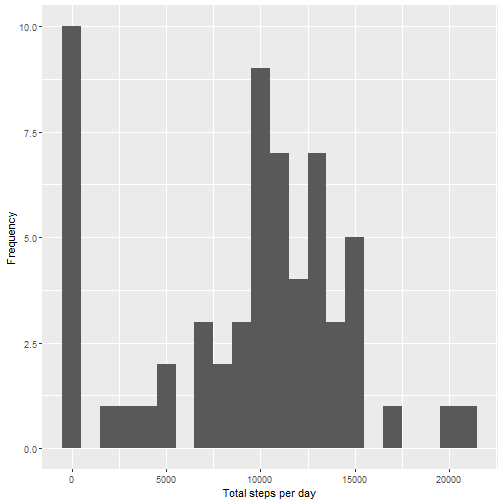

## Loading and preprocessing the data


```r
library(ggplot2)
```

```
## Warning: package 'ggplot2' was built under R version 4.0.5
```

```
## RStudio Community is a great place to get help: https://community.rstudio.com/c/tidyverse
```

```r
library(scales)
```

```
## Warning: package 'scales' was built under R version 4.0.5
```

```r
library(Hmisc)
```

```
## Warning: package 'Hmisc' was built under R version 4.0.5
```

```
## Loading required package: lattice
```

```
## Loading required package: survival
```

```
## Loading required package: Formula
```

```
## 
## Attaching package: 'Hmisc'
```

```
## The following objects are masked from 'package:base':
## 
##     format.pval, units
```

```r
unzip(zipfile="activity.zip")
data <- read.csv("activity.csv")

#flag for NA vaues
NA_flag<-is.na(data$steps)
#data excluding NA values
clean_data<-data[!NA_flag,]
```


## What is mean total number of steps taken per day?

```r
Total_steps_per_day=tapply(data$steps,data$date,FUN=sum,na.rm=TRUE)
print(qplot(Total_steps_per_day, xlab='Total steps per day', ylab='Frequency', binwidth=1000))
```



```r
m<-mean(Total_steps_per_day)
med<-median(Total_steps_per_day)
```
- Mean is 9354.2295082
- Median is 10395

## What is the average daily activity pattern?

```r
average <- aggregate(x=list(mean_steps=data$steps), by=list(interval=data$interval), FUN=mean, na.rm=TRUE)
print(ggplot(data=average, aes(x=interval, y=mean_steps)) +
    geom_line() +
    xlab("5-minute intervals") +
    ylab("Average number of steps taken"))
```


```r
max_interval <- average[which.max(average$mean_steps),]
```
5-minute interval with maximum number of steps is:
- 835, 206.1698113

## Imputing missing values

```r
missing_number<-sum(NA_flag)
```
The total number of missing values is 2304


```r
imputed_data<-data
imputed_data$steps <- impute(data$steps, fun=mean)
Total_steps_imputed <- tapply(imputed_data$steps, imputed_data$date, sum)
print(qplot(Total_steps_imputed, xlab='Total steps per day', ylab='Frequency', binwidth=1000))
```


```r
new_mean<-mean(Total_steps_imputed)
new_med<-median(Total_steps_imputed)
```
Original mean was 9354.2295082; new mean is 1.0766189 &times; 10<sup>4</sup>
Original median was 10395; new median is 1.0766189 &times; 10<sup>4</sup>
Effect: Median of data is pushed toward the mean

## Are there differences in activity patterns between weekdays and weekends?


```r
data$weekday <- weekdays(as.Date(as.character(data$date)))
data$weekend <- ifelse(data$weekday == "Saturday" | data$weekday == "Sunday", "Weekend", "Weekday")

new_average <- aggregate(list(new_steps=data$steps), by=list(weekend=data$weekend, new_interval=data$interval), mean,na.rm=TRUE)

print(ggplot(new_average, aes(x =new_interval, y=new_steps, color=weekend)) +
  geom_line() +
  facet_grid(weekend ~ .) +
  labs(title = "Mean of Steps", x = "interval", y = "steps"))
```


-There is some variation on weekdays whereas not much variation on weekends.


